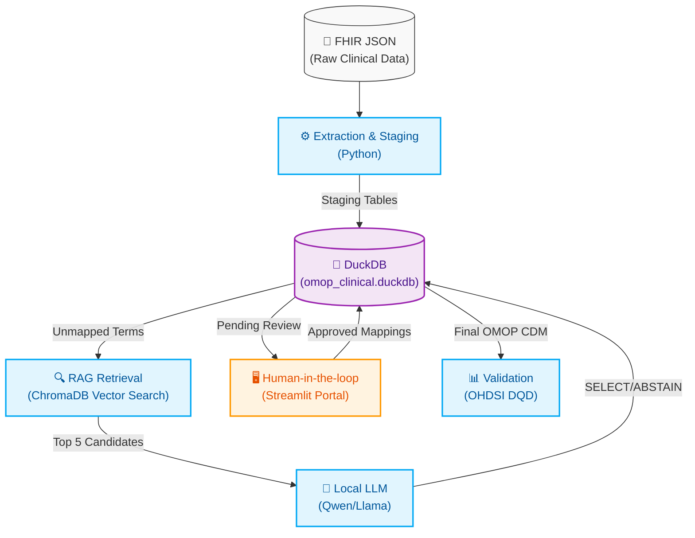

# 🏥 Clinical Mapping Framework (FHIR to OMOP CDM v5.4)

# 🏥 Clinical Mapping Framework (FHIR to OMOP CDM v5.4)

An end-to-end Health Data Engineering and Real-World Evidence (RWE) pipeline. This framework extracts raw clinical data from FHIR JSON bundles, standardizes it into the **OMOP Common Data Model (v5.4)**, and maps messy/legacy clinical text using a **Retrieval-Augmented Generation (RAG) + Human-in-the-Loop Architecture**.

Licensed under the [Apache License 2.0](LICENSE). Copyright and attribution are
recorded in [`NOTICE`](NOTICE). Third-party libraries, models, vocabularies and
datasets retain their own licences and terms.



## 🚀 Quick Start

Get the pipeline running locally in under 5 minutes:

```bash
# 1. Clone the repository
git clone https://github.com/MrCosta77/FHIR-to-OMOP.git
cd FHIR-to-OMOP

# 2. Create and activate a virtual environment
python -m venv venv
# On Windows:
venv\Scripts\activate
# On Mac/Linux:
source venv/bin/activate

# 3. Install dependencies
pip install -r requirements.txt

# 4. Configure environment (sets default paths and local LLM config)
cp .env.example .env

# 5. Run the full orchestrator
python main.py
```

## 📸 Review Portal (Human-in-the-Loop)

The framework includes a Streamlit portal for clinical experts to adjudicate LLM mappings. 
To launch it locally:
```bash
streamlit run src/app/review_portal.py
```


*(Note: Save a screenshot of your portal to `docs/assets/streamlit_portal.png` to display it here).*

## 🧠 Core Engineering Philosophy

This project was built with strict adherence to clinical data management standards, focusing on determinism, auditability, and OHDSI conventions:

1. **OMOP-Canonical Mapping (STCM):** AI candidates are stored as proposals, not mappings. Only a named human approval publishes a candidate to `approved_mapping_set` and `source_to_concept_map`; pending and rejected candidates never enter the active mapping set.
2. **Deterministic Tie-Breaking:** Avoids SQL *fan-out* issues (`QUALIFY ROW_NUMBER() = 1`) and guarantees high-fidelity mappings using the official `Maps To` relationship and Domain routing.
3. **Hierarchical Phenotyping:** RWE analytics leverage the `CONCEPT_ANCESTOR` table for accurate disease-group phenotyping rather than relying on brittle string matching.
4. **FHIR Unit Provenance:** `valueQuantity.unit`, `system`, and `code` are retained through staging. UCUM codes are matched case-sensitively to Standard OMOP `Unit` Concepts, while the original unit text and source concept are preserved.
5. **Standards-Based Era Derivation:** After approved STCM mappings are applied, mapped conditions are collapsed into `CONDITION_ERA` with a 30-day persistence window. Drug products are expanded through `CONCEPT_ANCESTOR` to every current Standard Ingredient before `DRUG_ERA` is derived. Both tables use deterministic IDs and are published together only after coverage and integrity checks pass.

## 🤖 The AI Mapping Engine & Governance Loop

Standard OMOP vocabularies handle the majority of clinical data, but real-world data (like legacy LIS lab results) is messy. This framework uses a progressive retrieval-adjudication system:

1. **RAG Retrieval:** Unmapped text triggers a vector search (ChromaDB) against standard OMOP vocabularies (e.g., LOINC) to retrieve the top 5 clinically valid candidates.
2. **LLM Adjudication:** A local LLM evaluates the 5 candidates through a strict JSON schema and returns either `SELECT` with one retrieved ID or `ABSTAIN` with a null ID. Invalid JSON, extra fields, and invented IDs fail closed.
3. **Blinded Human-in-the-Loop (Streamlit):** Every proposal receives a stable `mapping_decision_id`, `run_id`, affected-event provenance, model digest, prompt/vocabulary/index version, generation parameters, confidence, rationale, clinical signals and status. Two distinct reviewers submit mandatory rationales without seeing peer votes; only a third, distinct adjudicator can publish or reject the mapping. Rejections become active policy and suppress identical future proposals.
4. **Fail-closed privacy boundary:** The default classification is synthetic. PHI mode requires explicit institutional approval and retention configuration, authenticated role allowlists, a loopback-only Ollama endpoint, direct-identifier redaction before prompting, and metadata-only security audit logs. The standalone portal is not an identity provider and must not be used with PHI without institution-managed authentication.
4. **Active Learning (Few-Shot):** Human-approved mappings are dynamically injected back into the LLM's prompt in subsequent runs, creating a continuous feedback loop where the audit trail becomes the training data.

The retrieval layer is reproducible: the configured Chroma collections for
Condition, Drug, Measurement, and Procedure carry
a fingerprint of the valid vocabulary/domain slice, index schema version,
distance metric, and `build_complete` marker. Changed vocabularies trigger a
resumable rebuild; matching legacy collections are adopted without recomputing
embeddings. Few-shot examples use a stable order, candidate IDs are parsed by
exact membership, and `SIMILARITY_THRESHOLD` is enforced before a proposal can
enter the review queue.

The six domain adapters share one governed semantic-mapping engine. Procedure
and Device retrieval is restricted to current Standard SNOMED concepts in the
required domain; Observation combines only current Standard SNOMED and LOINC
Observation concepts. LLM output is recorded only as an event-level proposal
or abstention and never changes a clinical table before named human approval.
Approval preserves the selected concept's actual vocabulary rather than
inferring it from the target table.

The model-facing contracts, fail-closed parser, prompt renderer and provenance
value objects are isolated in the dependency-free `src/clinical_mapping_core/`
boundary. FHIR/OMOP, retrieval, Ollama, privacy and database publication remain
explicit adapters. See [`docs/CLINICAL_MAPPING_CORE.md`](docs/CLINICAL_MAPPING_CORE.md).
The first non-FHIR boundary accepts the versioned, allowlisted
[`hospital-csv-v1`](docs/HOSPITAL_CSV_ADAPTER.md) contract and converts its
redacted clinical fields into the same typed request. Its governed runner now
reuses Athena/Chroma retrieval and the local structured LLM to persist
idempotent pre-ingestion proposals and abstentions. These carry hashed record
keys and `publication_eligible=false`, so they cannot enter review,
adjudication, STCM or OMOP publication before a later ingestion step binds an
explicit source vocabulary and concrete OMOP event.

The 7D.4 [source identity and event-binding boundary](docs/SOURCE_IDENTITY_REGISTRY.md)
validates canonical hospital system/code claims, resolves them to one explicitly
registered local OMOP source vocabulary and atomically binds a `SELECT` proposal
to exactly one existing, unmapped, domain-correct OMOP event. Only that verified
binding promotes the proposal into the existing blinded review workflow. The
registry and event are revalidated at adjudication; approval publishes the
explicit local code/vocabulary to STCM, and STCM application is restricted to
the bound event. No adapter-side or single-review publication path is added.
The [7D.4C ingestion handoff](docs/INGESTION_HANDOFF.md) accepts strict receipts
from a successful, manifest-linked upstream ETL run and coordinates those
bindings per record. Its report is metadata-only, partial expected failures are
explicit, and the component never fabricates person, visit or clinical events
from the mapping CSV.

LLM candidates are recorded once per affected clinical event. Approval validates
that the target is a current Standard Concept in the required OMOP domain and
then publishes the term to STCM. `apply_stcm.py` independently requires matching
human-approved provenance, the correct domain-specific source vocabulary, a
current Standard Concept, and valid STCM dates. Legacy proposals are migrated to
decision records; pending legacy STCM rows are withdrawn, while historical
`target_id=0` placeholders remain preserved as superseded audit data.

Each orchestrated execution receives a `RUN-...` identifier and records the Git
commit, SHA-256 input manifest, configuration, step status and error details in
both `etl_run` and a local JSON manifest. Work happens against an isolated
staging DuckDB. The published database is replaced only after every mandatory
step and quality gate succeeds; failed staging databases are retained for
forensic inspection and do not alter the last successful publication.

## 📊 Results & Validation

### 1. Mapping Accuracy (against seeded synthetic LIS noise)
The optional benchmark corrupts a deterministic 10% slice of mapped laboratory
measurements and stores the expected concepts in `lis_noise_ground_truth`.
Coverage, precision and recall must be generated for a specific `run_id` with
`src/analytics/evaluate_mapping_accuracy.py`; the repository does not present
mutable, run-independent percentages as current evidence.

### 2. OHDSI Data Quality Dashboard (DQD)
The resulting DuckDB instance is validated with the native R
`DataQualityDashboard` package against OMOP v5.4. DQD JSON files remain local;
the repository versions the executable check configuration and a human-reviewed
acceptance policy instead of committing one favorable report. The Python gate
requires zero DQD execution errors, rejects unknown or stale allowances, and
enforces per-check row and percentage caps. The runner preserves all DQD
future-date evaluations while normalizing their threshold expression to native
DuckDB SQL. It executes `plausibleValueHigh` and `measureValueCompleteness` in
per-table isolated R processes to avoid driver memory accumulation, verifies
that every shard is disjoint, and merges them without excluding or weakening
any check. The repository does not commit local result JSON, so a fresh clone
must generate a run-linked DQD report before making a quality claim about its
published database.

### 3. Unit Mapping Contract

FHIR `valueQuantity` units use three explicit outcomes: a known UCUM unit maps
to its Standard OMOP `Unit` Concept; a supplied but unsupported annotation maps
to concept ID `0`; and a genuinely absent unit remains `NULL`. Reviewed UCUM
aliases are centralized in `src/utils/unit_mapping.py`; for example, FHIR
`{score}` maps deterministically to Standard OMOP `[score]` (44777566).
Semantically incompatible code/unit pairs are retained in a traceable ETL
quarantine rather than converted or silently published.

### 4. Dirty Hospital Data Benchmark

`benchmarks/dirty_hospital/` contains a versioned 100-case benchmark spanning
Condition, Measurement, Procedure, Observation, and Drug. Its 60 development
and 40 held-out cases have disjoint target concepts, and include coded input,
Portuguese/mixed-language dirty text, local hospital codes, and explicit safe
`ABSTAIN` cases. Labels are currently technical provisional curation and must
not be represented as clinically validated until human review is recorded.

Run the deterministic code-only baseline after building the Athena-backed DB:
```bash
python -m src.benchmark.evaluate_dirty_hospital --database data/omop_clinical.duckdb
```
The report records full provenance and separates accepted precision, mappable
recall, false mappings, abstain accuracy, coverage, and overall accuracy. Local
reports are written under ignored `benchmark_results/`.

The frozen Phase 5 protocol compares the deterministic baseline, Jaro-Winkler
fuzzy matching, embedding retrieval, and governed retrieval with both local LLM
models. It fixes the fixture hash, top-k, thresholds, generation parameters and
the no-few-shot policy before evaluating the held-out split:

```bash
python -m src.benchmark.evaluate_phase5 \
  --database data/omop_clinical.duckdb \
  --output benchmark_results/phase5_held_out.json
```

Do not use the held-out report to modify prompts or thresholds. Any future
calibration belongs to development data and requires a new untouched test set.

The frozen `phase5-v1` held-out run found no improvement over the deterministic
baseline at the governed 0.90 threshold: baseline, embedding retrieval, Qwen
and Llama all achieved 50% overall accuracy, 25% coverage and 100% accepted
precision. Fuzzy matching reached 52.5% accuracy and 30% coverage but made one
wrong mapping. Retrieval top-5 recall was 56.7% overall and only 35% among the
20 mappable fallback cases, making retrieval the primary measured bottleneck.
The versioned public summary retains the complete domain and operating-curve
metrics; its labels remain `PROVISIONAL_TECHNICAL`.

### 5. FHIR Encounter and Observation-Period Contract

Clinical events use an explicit FHIR `Encounter/{id}` reference before any
date-based matching. The reference must resolve to a visit for the same person
and the event date must fall inside that visit. Temporal fallback is allowed
only when no reference was supplied and exactly one visit covers the event;
zero or multiple candidates remain unlinked and are written to
`etl_quarantine`. Every outcome is recorded in `event_visit_linkage` as
`FHIR_REFERENCE`, `TEMPORAL_FALLBACK`, or `UNRESOLVED` with its run ID.

`OBSERVATION_PERIOD` uses encounter coverage when available and extends it only
when clinical-event evidence falls outside that range. If no encounter exists,
the event envelope is an explicit fallback. `observation_period_provenance`
records the evidence bounds and derivation method for every run.

### 6. Real-World Hospital Acceptance Testing

The repository provides a complete acceptance gate spanning all six domains (Condition, Drug, Measurement, Observation, Procedure, Device). The deterministic CI suite (`test_e2e_hospital_acceptance.py`) enforces the isolated mapping, fail-closed ingestion handoff, blinded human review, adjudication, and final STCM application logic. In addition, an executable real-environment script (`scripts/run_e2e_evaluation.py`) is provided to validate the active local RAG retrieval (Chroma) and unmocked LLM against the same target concepts, proving production readiness without generating PHI.

## 🛠️ Setup & Execution

**1. Environment Setup**
```bash
# Clone the repository
git clone https://github.com/MrCosta77/FHIR-to-OMOP.git
cd FHIR-to-OMOP

# Set up Python virtual environment
python -m venv .venv
source .venv/bin/activate  # On Windows: .\.venv\Scripts\activate
python -m pip install --require-hashes -r requirements.lock
```

The repository includes a small versioned FHIR golden bundle. Contract and
unit tests run in GitHub Actions without Athena, Ollama, or a local database:
```bash
python -m pytest -m "not integration" -v
```
Python 3.12 dependencies are transitively pinned with artifact hashes. The
official OHDSI R stack is pinned for R 4.6.1 in `renv.lock`; restore and release
instructions are in [`docs/RELEASE_PROCESS.md`](docs/RELEASE_PROCESS.md).
After building the local DuckDB, run the complete suite (including OMOP
integration checks):
```bash
python -m pytest -v
```
Any external FHIR bundle can be checked before ETL with
`python -m src.quality.validate_fhir <bundle-or-directory>`.

**2. Prerequisites**
* Download the **OMOP Vocabularies** from [Athena](https://athena.ohdsi.org/) and place `CONCEPT.csv`, `CONCEPT_RELATIONSHIP.csv`, `VOCABULARY.csv`, `DOMAIN.csv`, `CONCEPT_CLASS.csv` and `CONCEPT_ANCESTOR.csv` in `data/omop_vocab/`. Missing required files fail the run.
* Place synthetic **FHIR JSON bundles** (e.g., from Synthea) in `synthea/output/fhir/`. Every bundle is contract-validated before clinical tables are rebuilt.
* Ensure [Ollama](https://ollama.ai/) is installed and running locally with the model selected by the active profile. Development defaults to `qwen2.5-coder:7b`; benchmark and hospital default to `llama3.1`.

Check all mandatory pipeline inputs and services before starting a run:
```bash
python -m src.utils.config
python -m src.quality.preflight
```
Add `--include-dqd` to also require `Rscript` for the official OHDSI DQD.
Runtime settings come from the versioned `development`, `benchmark`, or
fail-closed `hospital` profile and explicit `CMF_*` overrides. See
[`docs/CONFIGURATION.md`](docs/CONFIGURATION.md) and [`.env.example`](.env.example).

**3. Run the Full Orchestrator**
Executes the full pipeline (Vocabularies ➔ Base ETL ➔ STCM Application ➔ Era Derivation ➔ Tests ➔ Analytics).
*(To test AI accuracy, inject LIS noise by setting `CMF_SIMULATE_LIS_NOISE="true"`).*
```bash
python main.py
```

Successful publications are written to `data/omop_clinical.duckdb`. Run
manifests are retained under `data/run_manifests/`; failed working databases are
kept under `data/runs/` and can be removed after investigation.

Each successful publication also writes a content-addressed, immutable evidence
report under `data/run_reports/` (or the active profile override). It aggregates
pytest, DQD status, mapping coverage, database/input hashes and provenance
without source values or identities. See
[`docs/RUN_REPORTS.md`](docs/RUN_REPORTS.md).

Run the reproducible Phase 6 scale test in a timestamped, isolated directory:
```bash
python -m src.benchmark.run_scale_test --population 250 --seed 6062026
```
The runner generates fresh synthetic FHIR, sets `CMF_FHIR_DIR` and
`CMF_DB_PATH` only for its child pipeline, captures both logs and writes a JSON
report under `benchmark_results/scale/`. It refuses to overwrite an existing
output directory, never opens the published clinical database and verifies from
pre/post file identity that the published database did not change.

The first run after a vocabulary change can take considerably longer while
active vector indexes are rebuilt. Progress is printed per 5,000 concepts and
an interrupted build resumes from the IDs already indexed.

**4. Run the Human-in-the-Loop Portal**
Launch the Streamlit app to curate pending AI mappings:
```bash
streamlit run src/app/review_portal.py
```

**5. Run OHDSI Clinical Validation (RStudio)**
Launch `src/analytics/view_dqd_dashboard.R` to view the interactive quality report.
After generating a new DQD JSON report, apply the versioned acceptance budget:
```bash
python -m src.quality.validate_dqd dqd_results/<new-report>.json
```
The gate permits no DQD execution errors. Failed checks are capped and accepted
only when their check type has an explicit reason in `quality/dqd_policy.json`.
Historical reports predate this gate and are not evidence of current acceptance.
